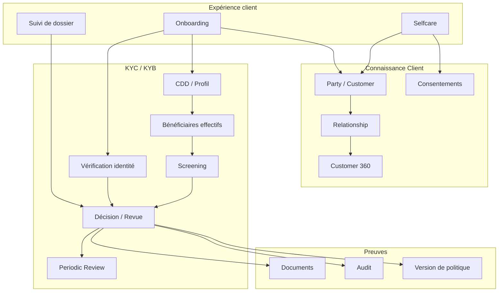

# I04 — Architecture fonctionnelle

**Statut : COMPLET — 2026-10-01**

## 1. Capability Map

## 2. Services fonctionnels

### F01 — Party Management
Créer, rechercher, rapprocher et maintenir une Party.

### F02 — Customer Lifecycle
Gérer Prospect → Customer → Active → Review → Closed.

### F03 — Relationship Management
Gérer rôles, mandats, représentants et liens.

### F04 — Identity Verification
Orchestrer la collecte et la vérification des attributs d’identité.

### F05 — KYC/KYB Case Management
Porter le dossier et sa machine d’état.

### F06 — Screening Coordination
Envoyer les demandes aux services externes et normaliser les réponses.

### F07 — Decision & Manual Review
Décider selon règles/politiques et gérer les cas non automatiques.

### F08 — Consent Management
Créer, retirer, versionner et prouver les consentements.

### F09 — Document & Evidence
Conserver métadonnées, empreintes, version et lien au dossier.

### F10 — Customer 360
Assembler une vue explicable du client et de ses relations.

### F11 — Notification
Informer client/conseiller sans rendre l’email/SMS maître de l’état métier.

### F12 — Customer Change Management
Gérer les demandes de modification et contrôles associés.

## 3. Matrice capacité ↔ acteurs

| Capacité | Client | Conseiller | Conformité | SI |
|---|---:|---:|---:|---:|
| Onboarding | X | X |  | X |
| Identity Verification | X | X | X | X |
| KYC/KYB |  | X | X | X |
| Consent | X | X | X | X |
| Customer 360 |  | X | X | X |
| Manual Review |  | X | X | X |
| Selfcare | X | X |  | X |
| Audit |  |  | X | X |

## 4. Événements métier fonctionnels

- `ProspectCreated`
- `IdentityVerificationRequested`
- `IdentityVerified`
- `KycCaseOpened`
- `KycInformationCompleted`
- `ScreeningRequested`
- `ScreeningCompleted`
- `ManualReviewRequested`
- `KycApproved`
- `KycRejected`
- `ConsentGranted`
- `ConsentWithdrawn`
- `CustomerCreated`
- `CustomerUpdated`
- `PeriodicReviewDue`

Les noms sont des contrats de référence à versionner, pas un standard externe.

## 5. Principes fonctionnels

1. L’identité et le client sont liés mais ne sont pas la même chose.
2. Prospect et Customer doivent être distingués.
3. La décision KYC est un résultat versionné et auditable.
4. Customer 360 est une vue, pas forcément un maître.
5. Les consentements ont leur propre cycle de vie.
6. La revue humaine est modélisée explicitement.
7. Toute mutation sensible doit avoir une provenance.
8. Le système doit pouvoir représenter l’incertitude.

## 6. Critères de sortie I04

- [x] capability map ;
- [x] services fonctionnels ;
- [x] acteurs ;
- [x] événements métier ;
- [x] principes.
