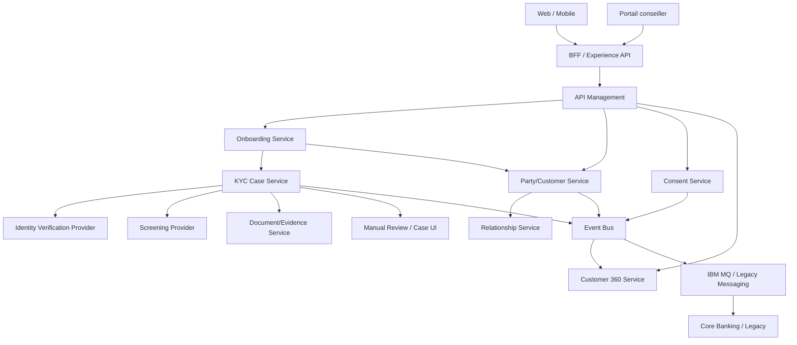

# I05 — Architecture applicative

**Statut : COMPLET — 2026-10-01**

## 1. Vue cible

## 2. Responsabilités applicatives

| Composant | Responsabilité | Ne doit pas faire |
|---|---|---|
| BFF | composition pour canal | porter le dossier KYC |
| API Management | sécurité/exposition/quota | logique Customer |
| Onboarding Service | orchestration parcours | devenir MDM |
| Party/Customer Service | identité métier de la Party/Customer | appeler chaque front |
| KYC Case Service | état/contrôles/décision KYC | stocker tous les documents binaires |
| Consent Service | ledger consentements | devenir IAM |
| Relationship Service | rôles/liens/mandats | remplacer le core |
| Evidence Service | métadonnées/preuves | décider KYC |
| Customer 360 | lecture consolidée | modifier silencieusement les maîtres |
| Manual Review | tâches humaines | bypasser audit/règles |

## 3. Bounded contexts

- Identity
- Party/Customer
- Relationship
- KYC/KYB
- Consent
- Evidence
- Onboarding
- Customer 360
- Notification
- Integration

Les frontières restent logiques : leur déploiement physique peut évoluer.

## 4. Contrats synchrones

Synchrone recommandé pour :
- consultation Customer 360 ;
- validation de format ;
- lecture de statut ;
- commandes nécessitant réponse immédiate.

Asynchrone recommandé pour :
- propagation des changements ;
- screening long ;
- synchronisation legacy ;
- notifications ;
- recalcul Customer 360 ;
- periodic review scheduling.

## 5. Cohérence

Le modèle privilégie :
- transaction locale forte par bounded context ;
- propagation événementielle ;
- idempotence des consommateurs ;
- version d’événement ;
- reconciliation périodique ;
- traitement explicite des doublons et réponses tardives.

## 6. Anti-patterns évités

- base partagée par tous les microservices ;
- Customer 360 utilisé comme maître universel ;
- BFF contenant les règles KYC ;
- logique réglementaire dans l’API Gateway ;
- appels synchrones en cascade sur toutes les dépendances ;
- publication d’événement avant commit sans Outbox ou mécanisme équivalent ;
- suppression d’une preuve lors d’une mise à jour.

## 7. Critères de sortie I05

- [x] composants ;
- [x] responsabilités ;
- [x] bounded contexts ;
- [x] sync/async ;
- [x] cohérence ;
- [x] anti-patterns.
