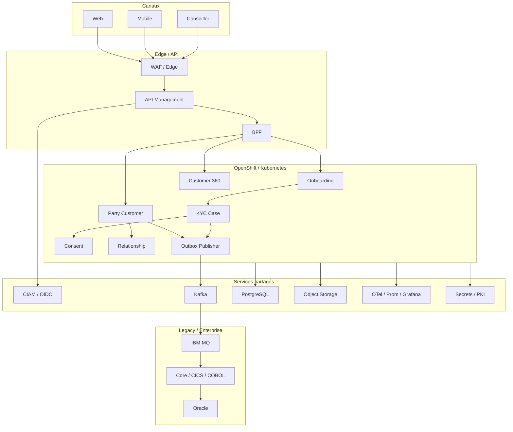

# I09 — Architecture technique

**Statut : COMPLET — 2026-10-01**

## 1. Principe

Le produit Customer/KYC/Digital ne possède pas sa propre plateforme technique complète. Il consomme les capacités de la **Common Technical Platform MayaBank**.



## 2. Classification technique

| Capacité | Mode |
|---|---|
| OpenShift/Kubernetes | CONSUME_SHARED |
| Namespace/Project factory | CONSUME_SHARED |
| GitOps / Argo CD | CONSUME_SHARED |
| Registry/Artifacts | CONSUME_SHARED |
| CIAM runtime | CONSUME_SHARED |
| API Management | SPECIALIZED_PLATFORM |
| Kafka | CONSUME_SHARED |
| IBM MQ | SPECIALIZED_PLATFORM |
| PostgreSQL | CONSUME_SHARED |
| Oracle | REFERENCE_ONLY / legacy |
| Object storage | CONSUME_SHARED |
| Observability | CONSUME_SHARED |
| Vault/PKI | CONSUME_SHARED |
| Customer schemas | PRODUCT_OWNED |
| KYC schemas | PRODUCT_OWNED |
| Topics/contracts produit | PRODUCT_OWNED |

## 3. Déploiement logique

Namespaces possibles :

```text
customer-digital
customer-kyc
customer-data
```

La séparation réelle dépend de :
- ownership ;
- isolation ;
- cycle de livraison ;
- criticité ;
- règles réseau ;
- volumétrie.

Ne pas multiplier les namespaces uniquement pour refléter les bounded contexts.

## 4. Réseau

Flux minimaux :
- Internet/client → edge/WAF ;
- edge → API Management ;
- API → BFF/services ;
- services → CIAM ;
- services → data ;
- services → Kafka ;
- integration adapter → MQ ;
- MQ → core legacy ;
- services → providers KYC/screening via egress contrôlé ;
- télémétrie → observabilité.

## 5. Secrets et certificats

Aucun secret dans :
- dépôt Git ;
- image ;
- manifest en clair ;
- variable de build exposée.

Patterns :
- secret manager/Vault ;
- service account/workload identity lorsque disponible ;
- rotation ;
- PKI/cert lifecycle ;
- séparation machine/user credentials.

## 6. GitOps

Le produit fournit :
- manifests/Kustomize/Helm selon standard ;
- config par environnement ;
- policies ;
- références de secrets, jamais valeurs ;
- probes ;
- resource requests/limits ;
- NetworkPolicies ;
- ServiceMonitor/OTel config selon plateforme.

La plateforme fournit Argo CD et le cycle de promotion.

## 7. Scalabilité

Stateless autant que possible pour :
- BFF ;
- API services ;
- orchestrateurs.

Stateful maîtrisé pour :
- KYC cases ;
- customer records ;
- consent ledger ;
- outbox ;
- read models.

Le scaling horizontal ne remplace pas la correctness des transactions.

## 8. Critères de sortie I09

- [x] placement ;
- [x] dépendances ;
- [x] déploiement logique ;
- [x] réseau ;
- [x] secrets ;
- [x] GitOps ;
- [x] scalabilité.
