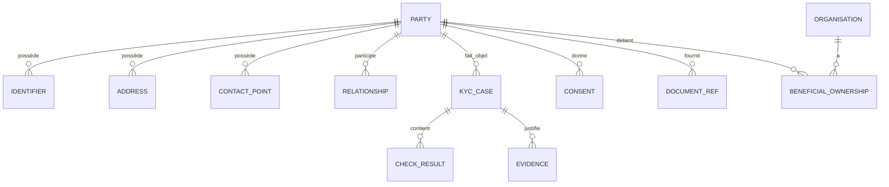

# I06 — Architecture de l’information et des données

**Statut : COMPLET — 2026-10-01**

## 1. Modèle conceptuel



## 2. Entités

### Party
`party_id`, type, statut, dates de cycle de vie.

### Person
nom, prénoms, date de naissance, lieu, nationalités, attributs nécessaires selon finalité.

### Organisation
raison sociale, forme, pays, immatriculation, activité.

### Identifier
type, valeur tokenisée/masquée selon besoin, émetteur, validité.

### Relationship
source_party, target_party, role, dates, statut.

### KycCase
case_id, party_id, state, risk_level, policy_version, decision, timestamps.

### Consent
purpose, scope, version, granted_at, withdrawn_at, evidence_ref.

### Evidence
type, source, hash, storage_ref, collected_at, valid_until.

## 3. Mastership

Exemple de matrice de référence :

| Donnée | Maître cible | Répliques |
|---|---|---|
| Party ID | Customer Registry | CRM, Core, channels |
| Identité vérifiée | Identity/KYC | Customer Registry |
| Relation bancaire | Core/Relationship selon contexte | Customer 360 |
| Consentement | Consent Service | channels / analytics autorisés |
| Décision KYC | KYC Case | Customer 360 / Core |
| Document binaire | Object/Evidence store | référence uniquement |
| Adresse de contact | Customer domain selon governance | Core/CRM |

La matrice exacte est `DISCOVERY_REQUIRED` en contexte réel.

## 4. Customer 360

Customer 360 est construit selon quatre règles :

1. provenance visible ;
2. fraîcheur visible ;
3. conflits non masqués ;
4. droit de mutation explicite.

Deux options :
- **composition à la lecture** ;
- **read model matérialisé** alimenté par événements.

Le choix dépend des volumes, latences, tolérance à la fraîcheur et disponibilité des sources.

## 5. Dédoublonnage

Pipeline de référence :

```text
Candidate
  ↓
Normalisation
  ↓
Exact matching
  ↓
Probabilistic / fuzzy candidates
  ↓
Policy threshold
  ↓
Auto-link | Manual review | New Party
```

La fusion automatique de personnes est une opération sensible : réversibilité et audit sont obligatoires.

## 6. Data quality

Dimensions :
- complétude ;
- exactitude ;
- unicité ;
- cohérence ;
- fraîcheur ;
- validité ;
- traçabilité.

## 7. Privacy

Principes :
- minimisation ;
- limitation des finalités ;
- rétention pilotée ;
- accès par besoin ;
- pseudonymisation/tokenisation lorsque pertinente ;
- séparation données métier / secrets / preuves ;
- journalisation sans fuite de données sensibles ;
- gestion de droits sans casser les obligations légales de conservation.

## 8. Lineage

Chaque donnée critique doit permettre de répondre :
- quelle source ?
- quelle date ?
- quelle version ?
- quelle transformation ?
- quel système maître ?
- quelle politique ?
- quel consommateur ?

## 9. Critères de sortie I06

- [x] modèle conceptuel ;
- [x] mastership ;
- [x] Customer 360 ;
- [x] dédoublonnage ;
- [x] qualité ;
- [x] privacy ;
- [x] lineage.
