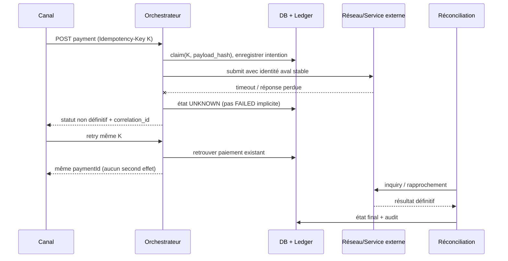

# SOLUXAN-S2 — Deep dive logiciel : paiement au statut UNKNOWN

**Statut : REFERENCE_CROSS_REPO / preuves existantes liées, pas nouveau test exécuté par S2.**  
**Objectif :** montrer en entretien que la démarche d'architecture applicative n'est pas seulement théorique, avec un scénario technique concret **différent du domaine KYC**.

## Besoin bancaire

Lorsqu'un paiement est envoyé à un système externe, le traitement peut avoir été effectué alors que la réponse a été perdue. Un timeout réseau ne doit pas produire un deuxième effet financier ni transformer une opération incertaine en rejet définitif.

## Allocation des responsabilités

| Besoin / invariant | Responsable applicatif | Mécanisme | Preuve/revue |
|---|---|---|---|
| une intention stable | Consumer / Acceptor | idempotency key + payload hash | [I18](https://github.com/zdmooc/mayabank-instant-payments-resilience-platform/blob/main/docs/evidence/I18-distributed-correctness.md) |
| une seule opération financière | Payment Orchestrator + PostgreSQL | claim atomique, unique key et ledger effect | [ADR-003](https://github.com/zdmooc/mayabank-instant-payments-resilience-platform/blob/main/docs/adr/ADR-003-idempotency-mandatory.md) |
| timeout ne signifie pas échec | Orchestrator | état UNKNOWN, inquiry + reconciliation, pas replay aveugle | [ADR-002](https://github.com/zdmooc/mayabank-instant-payments-resilience-platform/blob/main/docs/adr/ADR-002-unknown-not-failed.md) |
| publication fiable des événements | Outbox Publisher | transaction Outbox locale, lease et requeue | [I18](https://github.com/zdmooc/mayabank-instant-payments-resilience-platform/blob/main/docs/evidence/I18-distributed-correctness.md) |
| réceptions at-least-once | Inbox / projection | dedup sur event id | [ADR-006](https://github.com/zdmooc/mayabank-instant-payments-resilience-platform/blob/main/docs/adr/ADR-006-inbox-dedup-at-least-once.md) |
| contrat d'exposition | API Payment | REST contract, correlation et idempotency | [OpenAPI](https://github.com/zdmooc/mayabank-instant-payments-resilience-platform/blob/main/contracts/openapi/payment-api.yaml) |

## Séquence à raconter en entretien

## Arbitrage du logiciel

| Option | Avantage | Défaut rédhibitoire ou condition |
|---|---|---|
| Rejouer automatiquement après timeout | simplicité apparente | **rejetée : risque de deuxième effet financier** |
| Déclarer FAILED après timeout | réponse immédiate | **rejetée : mensonge sur l'état bancaire réel** |
| UNKNOWN + identifiant stable + inquiry/reconcile | préserve exactitude métier et reprise | **retenue** : implique état persistant, contrôles et exploitation de cas exceptions |

## Preuves existantes — périmètre exact

Le dépôt Instant Payments documente en I18 des essais CRC mono-nœud :
- concurrence 10/50/100 requêtes pour même intention ; invariant single-effect ;
- crash après succès aval et avant complétion locale côté Consumer/Acceptor ;
- même identité idempotente au retry ;
- deux replicas orchestrateur sur le **même nœud** avec Outbox lease/inbox.

**Ne prouve pas** multi-AZ, multi-site, worker loss, broker HA, production readiness ou SLA bancaire. Le paquet S2 établit la **liaison d'architecture** vers ces preuves ; aucun test nouveau n'a été lancé.

## Pont de transposition vers Customer/KYC

Le principe **UNKNOWN ≠ FAILED** s'applique aussi à `customer_creation_id` dans [I08 Customer](../integration/I08_API_EDA_MQ_LEGACY.md). Il ne faut **pas** déduire que les tests paiements valent tests Customer en production : seul le **pattern** est partagé. Les critères Customer restent S1 `AC-01`, `AC-08`, `AC-10` **NOT_EXECUTED**.

## Questions d'entretien à anticiper

1. Pourquoi le retry peut-il être dangereux après un timeout ?
2. Où placer l'idempotency key et comment gérer un payload différent ?
3. Pourquoi l'Outbox est-elle at-least-once plutôt qu'exactly-once ?
4. Qui est maître de l'état financier versus le read model ?
5. Quelle preuve limite les claims au CRC local et quelles étapes seraient nécessaires avant production ?
6. Comment ce raisonnement nourrit-il la revue d'architecture métier et la matrice de risques ?
