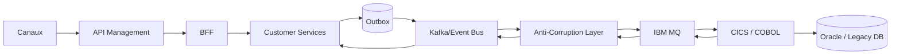

# I08 — API, EDA, IBM MQ et modernisation legacy

**Statut : COMPLET — 2026-10-01**

## 1. Objectif

Relier les parcours digitaux modernes à un SI bancaire pouvant contenir APIs, Kafka, IBM MQ, COBOL/CICS, Oracle et applications historiques, sans imposer un remplacement Big Bang.

## 2. Vue d’intégration



## 3. Quand utiliser API

Préférer API pour :
- commandes interactives ;
- lectures ;
- expérience client ;
- opérations nécessitant validation immédiate ;
- exposition contrôlée aux partenaires.

## 4. Quand utiliser événement

Préférer événement pour :
- propagation de changement ;
- intégration découplée ;
- recalcul de read models ;
- notifications ;
- audit métier ;
- synchronisation tolérant une latence contrôlée.

## 5. Quand utiliser IBM MQ

Patterns :
- intégration transactionnelle avec legacy ;
- JMS ;
- request/reply ;
- messages persistants ;
- systèmes historiques déjà intégrés par queues.

Le dépôt IBM MQ spécialiste reste propriétaire de la preuve Native HA/OAM/CHLAUTH.

## 6. Anti-Corruption Layer

Le modèle moderne ne doit pas adopter les contraintes du legacy.

Exemple :

```text
CustomerCreated v1
      ↓
Customer Legacy Adapter
      ↓
mapping / validation / enrichment
      ↓
MQ message
      ↓
COBOL transaction
```

La réponse legacy est normalisée avant retour au domaine Customer.

## 7. Strangler

### Phase A
Legacy maître ; façade API.

### Phase B
Nouveaux parcours utilisent services modernes, synchronisation vers legacy.

### Phase C
Mastership déplacé attribut par attribut.

### Phase D
Fonctions legacy retirées lorsqu’elles ne sont plus nécessaires.

Pas de migration totale imposée.

## 8. Idempotence

Toutes les commandes sensibles utilisent un identifiant stable :
- `onboarding_request_id`
- `customer_creation_id`
- `change_request_id`

Un retry ne doit pas créer un deuxième client.

## 9. UNKNOWN

Cas :
1. commande envoyée ;
2. timeout ;
3. résultat inconnu ;
4. ne pas refaire aveuglément ;
5. inquiry/reconciliation ;
6. converger vers l’état final.

Ce pattern est réutilisé des flagships paiements mais appliqué au domaine Customer.

## 10. Transactional Outbox

Lorsqu’une mutation locale et un événement doivent rester cohérents :

```text
BEGIN
  update business state
  insert outbox event
COMMIT

publisher -> event bus
consumer -> idempotent processing
```

## 11. Schémas d’événements

Chaque événement doit porter :
- event_id ;
- event_type ;
- schema_version ;
- aggregate_id ;
- occurred_at ;
- correlation_id ;
- causation_id ;
- source ;
- payload minimal nécessaire.

## 12. Reconciliation

Comparer périodiquement :
- Customer Registry ;
- événements publiés ;
- accusés legacy ;
- état core ;
- Customer 360.

Les écarts deviennent des cas d’exploitation.

## 13. Decision Gate runtime

À la fin d’I08, l’architecture couvre déjà les compétences attendues.

Décision actuelle : **PAS de runtime lourd immédiat**.

Justification :
- la mission cible d’abord Architecture SI ;
- Kafka, MQ, OpenShift et data ont déjà des preuves dans le portefeuille ;
- construire encore une stack technique dupliquerait des preuves existantes.

Runtime futur uniquement si une preuve métier Customer/KYC est explicitement demandée.

## 14. Critères de sortie I08

- [x] API ;
- [x] EDA ;
- [x] MQ ;
- [x] legacy ;
- [x] ACL ;
- [x] strangler ;
- [x] idempotence ;
- [x] UNKNOWN ;
- [x] Outbox ;
- [x] reconciliation ;
- [x] runtime gate.
