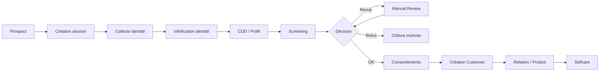
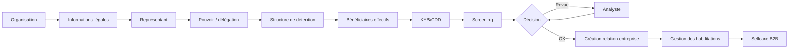

# I03 — Parcours digitaux B2C / B2B / Selfcare

**Statut : COMPLET — 2026-10-01**

## 1. Parcours B2C — personne physique



### Principes

- session ≠ customer définitif ;
- chaque reprise de parcours est idempotente ;
- chaque contrôle produit une trace ;
- la décision conserve la version de politique/règle ;
- le passage au core banking est un changement d’état maîtrisé ;
- un timeout du core ne vaut ni succès ni échec définitif.

## 2. Parcours B2B — personne morale



### Particularités

- plusieurs Parties pour un même dossier ;
- graph de relations ;
- pouvoirs et mandats ;
- bénéficiaires effectifs ;
- délégation d’administration ;
- droits de plusieurs utilisateurs sur la même relation entreprise.

## 3. Selfcare

Cas d’usage :

- mise à jour adresse ;
- mise à jour téléphone/email ;
- gestion préférences ;
- consultation consentements ;
- renouvellement document ;
- actualisation KYC ;
- ajout/retrait d’un mandataire selon règles ;
- téléchargement d’attestations ;
- suivi d’un dossier.

### Politique de modification

Tous les attributs ne sont pas directement modifiables.

```text
Modification demandée
       ↓
Classification sensibilité
       ↓
Faible risque ─────────→ Mise à jour contrôlée
       |
       └→ Risque moyen/fort
               ↓
        re-auth / MFA
               ↓
        evidence / contrôle
               ↓
          approbation
```

## 4. Reprise de parcours

Le parcours doit survivre à :
- fermeture navigateur ;
- changement de device ;
- expiration session ;
- fournisseur d’identité indisponible ;
- screening indisponible ;
- core legacy indisponible ;
- réponse tardive/dupliquée.

Le dossier métier constitue la source de reprise, pas l’état éphémère du front.

## 5. Human-in-the-loop

La revue humaine n’est pas une anomalie technique : elle constitue un état métier explicite.

Entrées possibles :
- identité incertaine ;
- document illisible ;
- données contradictoires ;
- résultat de screening ambigu ;
- structure juridique complexe ;
- exception de politique.

Sorties :
- APPROVED ;
- REJECTED ;
- REQUEST_MORE_INFORMATION ;
- ESCALATED.

## 6. KPIs métier indicatifs

- taux d’abandon ;
- taux de straight-through processing ;
- temps moyen d’onboarding ;
- taux de dossiers en revue ;
- délai de revue ;
- taux de rejet ;
- taux de reprise réussie ;
- erreurs de synchronisation core ;
- incohérences Customer 360.

Les seuils exacts sont `DISCOVERY_REQUIRED`.

## 7. Critères de sortie I03

- [x] B2C ;
- [x] B2B ;
- [x] selfcare ;
- [x] reprise de parcours ;
- [x] human review ;
- [x] KPIs.
