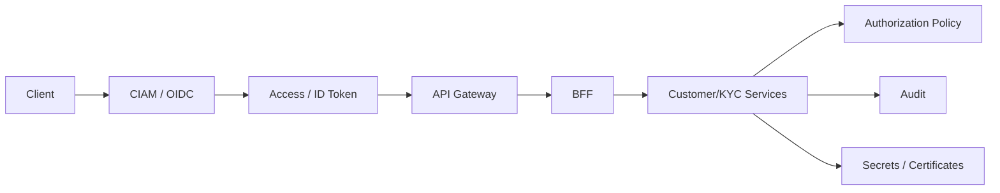

# I07 — CIAM, sécurité et privacy

**Statut : COMPLET — 2026-10-01**

## 1. CIAM ≠ Customer Master

Le CIAM répond à :
- qui s’authentifie ?
- avec quel niveau d’assurance ?
- quels facteurs ?
- quelles sessions ?
- quelles autorisations digitales ?

Le Customer domain répond à :
- qui est la Party ?
- quelle relation bancaire ?
- quel KYC ?
- quelles données métier ?
- quels consentements ?

Les identifiants sont liés, jamais confondus.

## 2. Vue sécurité



## 3. Authentification

Patterns :
- OIDC pour authentification front ;
- OAuth2 pour délégation d’accès ;
- MFA/step-up selon risque ;
- re-authentification pour opérations sensibles ;
- gestion de sessions et révocation ;
- device/risk signals comme input de politique, sans en faire une vérité unique.

## 4. Autorisation

Combiner selon besoin :
- RBAC pour rôles stables ;
- ABAC pour attributs dynamiques ;
- policy decision centralisable ;
- contrôle côté service, pas seulement gateway.

Exemple B2B :
```text
User
 + Organisation
 + Mandate
 + Role
 + Product
 + Action
 + Risk Context
 = Authorization Decision
```

## 5. Consentement

Le Consent Service stocke :
- sujet ;
- finalité ;
- portée ;
- version ;
- canal ;
- date d’octroi ;
- preuve ;
- retrait ;
- source.

Le CIAM peut présenter l’expérience, mais ne remplace pas nécessairement le ledger métier de consentements.

## 6. Menaces majeures

| Menace | Contrôle d’architecture |
|---|---|
| Account takeover | MFA, risk-based auth, session control |
| Credential stuffing | rate limiting, detection, breached-password controls |
| Identity fraud | verification, liveness selon contexte, review |
| Token theft | courte durée, secure storage, sender constraints lorsque applicable |
| Broken access control | service-side authZ, tests, least privilege |
| IDOR/BOLA | ownership checks systématiques |
| Data leakage logs | redaction, structured logging |
| Replay | nonce/idempotency/timestamps selon flux |
| Insider misuse | segregation, audit, privileged access controls |
| Vendor compromise | isolation, least privilege, exit/reversibility |
| Consent bypass | policy enforcement + immutable evidence |

## 7. Privacy by design

- minimiser les données collectées ;
- justifier chaque finalité ;
- segmenter les accès ;
- contrôler les exports ;
- éviter les données sensibles dans les topics/logs quand non nécessaires ;
- chiffrer en transit et au repos ;
- gouverner rétention/archivage ;
- documenter sous-traitants et transferts.

## 8. Identité numérique européenne

Le règlement (UE) 2024/1183 établit le cadre européen relatif à une identité numérique. Le dépôt le traite comme une **capacité d’intégration future** possible, pas comme une hypothèse obligatoire de chaque parcours.

## 9. Critères de sortie I07

- [x] séparation CIAM/Customer ;
- [x] authN ;
- [x] authZ ;
- [x] consent ;
- [x] menaces ;
- [x] privacy ;
- [x] identité numérique future.
